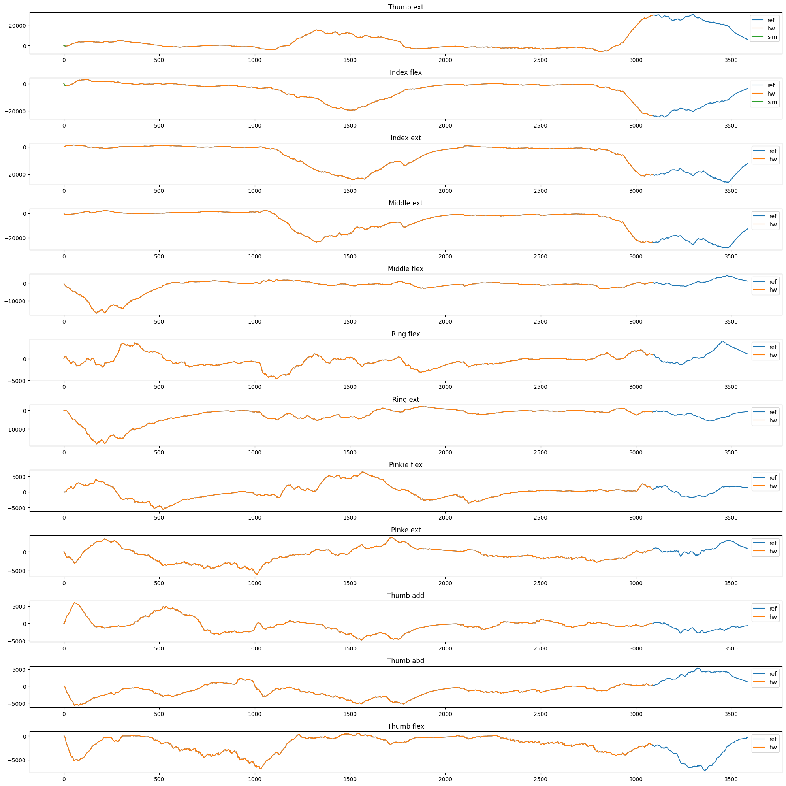
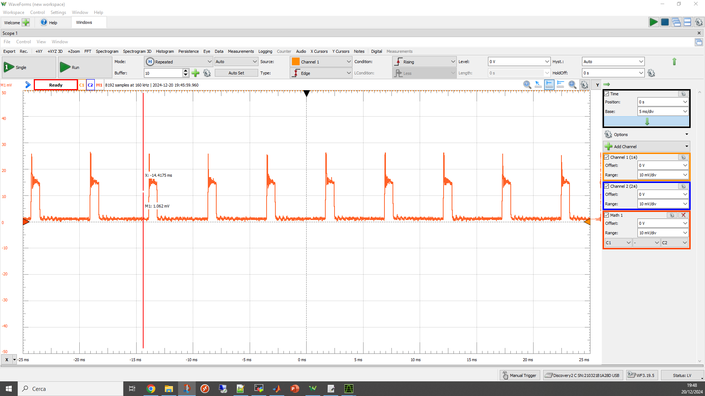

# SYNtzulu: A Tiny RISC-V-Controlled SNN Processor for Real-Time Sensor Data Analysis on Low-Power FPGAs

SYNtzulu is a Spiking Neural Network (SNN) processing element designed to be used in low-cost and low-power FPGA devices, enabling for real-time and near-sensor data analysis. The system features a **dual-core neuromorphic processor**, with each core capable of processing four synapses and one neuron per clock cycle. Additionally, it includes a **tiny RISC-V subsystem** (SERV + Servant platform) that manages the input/output operations and configures runtime parameters.  evaluated the system, which was implemented on a **Lattice iCE40UP5K FPGA**, in various use cases employing SNNs with accuracy comparable to the state-of-the-art. 
In its current version, SYNtzulu: 
- Fetches input data via a **12 MHz SPI** interface.
- Transmits inference results through a **2 MHz UART**.
- Dissipates a maximum power of **14.2 mW** when performing SNN inference while clocked at **24 MHz**, excluding input/output power consumption.
- Consumes as little as **0.3 mW** in **idle** mode.

**Device Utilization**  

| Resource             | Used | Total | Utilization (%) |
|-----------------------|------|-------|----------------|
| ICESTORM_LC          | 3473 | 5280  | 65%             |
| ICESTORM_RAM         | 17   | 30    | 56%             |
| SB_IO                | 14   | 96    | 14%             |
| SB_GB                | 8    | 8     | 100%            |
| ICESTORM_PLL         | 0    | 1     | 0%              |
| SB_WARMBOOT          | 0    | 1     | 0%              |
| ICESTORM_DSP         | 2    | 8     | 25%             |
| ICESTORM_HFOSC       | 1    | 1     | 100%            |
| ICESTORM_LFOSC       | 1    | 1     | 100%            |
| SB_I2C               | 0    | 2     | 0%              |
| SB_SPI               | 0    | 2     | 0%              |
| IO_I3C               | 0    | 2     | 0%              |
| SB_LEDDA_IP          | 0    | 1     | 0%              |
| SB_RGBA_DRV          | 0    | 1     | 0%              |
| ICESTORM_SPRAM       | 4    | 4     | 100%            |


For further details regarding SYNtzulu see the related paper available in open access [here](https://ieeexplore.ieee.org/document/10666827)

# SYNtzulu's flow

To introduce you to SYNtzulu, we have prepared a demo that showcases its capabilities. The demo involves decoding a 16-channel sEMG signal into 12 classes, each corresponding to a specific hand gesture. The biosignal is event-encoded using a variant of the delta modulation algorithm. Consequently, the network has 32 input channels (each sEMG channel is mapped into two spiking channels) and 12 output channels (one for each class). The network consists of four dense layers with 64, 128, 64, and 12 neurons, respectively.

The flow comprises two Python scripts that guide you through the training and deployment process:

1. *semg_syntzulu_demo*\
  This script leverages the Lava-DL platform to train a four-layer dense SNN using a single recording from the Ninapro DB5 dataset. The resulting model is quantized and exported using a custom class, which provides the input for the second script.\
Key output: Trained and quantized model (*continuous_sEMG_classification.obj*)

2. *syntzulu-hw-file-generator*\
  This script takes the quantized model generated by the first script and produces all the necessary files to configure the SYNtzulu's hardware and firmware for real-time inference.\
Key output: Application folder (*emg*)

Once you get the application folder (*emg*) copy it inside *SYNtzulu/*.

## Environment setup
SYNtzulu has been tested with the oss_cad_suite (version 2023-07-28), which can be downloaded [here](https://github.com/YosysHQ/oss-cad-suite-build/releases/tag/2023-07-28).
After downloading and extracting the archive, prepare the environment by running the following command:
```
source oss_cad_suite/environment
```
Additionally, a **RISC-V cross-compiler** is required to compile the firmware. If your system does not already include it, execute the following commands or refer to the [riscv-gnu-toolchain page](https://github.com/riscv-collab/riscv-gnu-toolchain)
```
git clone https://github.com/riscv/riscv-gnu-toolchain --recursive
cd riscv-gnu-toolchain/
./configure --prefix=/opt/riscv --with-arch=rv32i --with-abi=ilp32
sudo make
```

## Simulation
The first step is to copy the new application folder into the root of SYNtzulu.
Then, to properly configure the new application, use the following command:
```
make create_application app=emg
```
If you are not following the demo instructions, replace *emg* with the name of your application folder.
This command will automatically place the configuration files in the proper paths and compile the firmware.

To start the simulation, simply execute the command:
```
make simulate
```
This process may take a few minutes. If the delta modulation and inference results are correct, the inference results will appear in the terminal. If there are mismatches between simulated and expected results, the errors will be reported in the terminal.

## First run

### Flash setup

Before testing the system, you must write the flash memory with the test vector, as the flash will emulate an sEMG SPI sensor:
```
cd flash
./flash_program.sh
```
The operation will take several minutes.

### Building the system

To build SYNtzulu, execute the following command from the root of the project:
```
make build
```

Then write the bitstream to the flash memory using:
```
make prog
```
> [!WARNING]
> Check the jumpers of yours iCEbreaker are in "Program Flash" mode. This should be the default configuration.

To store the inference results, use the following command:
```
make listen
```
**Push the uButton**, located to the right of the supply port on the iCEBreaker, to start execution.

## Check the results

You can upload the simulation and hardware results into the *syntzulu-hw-file-generator* notebook, in the section *Simulation and Hardware Results Verification vs Ground Truth* to verify their correctness:  
1. Simulation results: *sim/results/emg/snn_inference.txt*
2. Hardware results *output/serial.txt*
   
You should get something like the image below, depending on how long your simulation and hardware test are.


## Power consumption

The most cheap method to measure the power consumption of the system involves:
1. Cutting the VCORE jumper,
2. Soldering a shunt resistor (we used 3.3 ohm)
3. Measuring the voltage drop using an oscilloscope (we used the Analog Discovery 2 Oscilloscope).

This is what we observed: 


# Citation

If you wish to cite this work, please use the following: 

@ARTICLE{10666827,  
  author={Leone, Gianluca and Scrugli, Matteo Antonio and Badas, Lorenzo and Martis, Luca and Raffo, Luigi and Meloni, Paolo},  
  journal={IEEE Transactions on Circuits and Systems I: Regular Papers},  
  title={SYNtzulu: A Tiny RISC-V-Controlled SNN Processor for Real-Time Sensor Data Analysis on Low-Power FPGAs},  
  year={2024},  
  volume={},  
  number={},  
  pages={1-12},  
  keywords={Field programmable gate arrays;Encoding;Neurons;Computer architecture;Real-time systems;Hardware;Synapses;Spiking neural network (SNN);edge AI;field programmable gate array (FPGA);energy efficiency;RISC-V},  
  doi={10.1109/TCSI.2024.3450966} }

# Acknowledgments

We would like to thank the following repositories and authors for providing modules and resources that were invaluable in this project:

- [YosysHQ - Open Source EDA](https://github.com/YosysHQ/oss-cad-suite-build)
- [SERV](https://github.com/olofk/serv/tree/main)
- [BasicUART](https://github.com/STjurny/BasicUART)
- [ice40_power](https://github.com/tinyvision-ai-inc/ice40_power)
- [picorv32](https://github.com/YosysHQ/picorv32)
